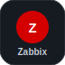
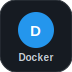
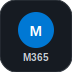
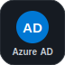
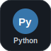
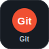
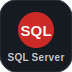
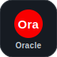

# Olá 👋, eu sou Leonardo Azevedo

### Linux Specialist • Observability • Incident Management N3 • IAM

**Rocky Linux | Ubuntu Server | Zabbix | Grafana | Microsoft 365 | Azure AD | Docker | Segurança da Informação**

---

## 🚀 Sobre mim

Analista de Infraestrutura e Segurança da Informação com atuação em ambientes de missão crítica e alta disponibilidade, especializado em **Linux** e **Observabilidade**, com forte foco em performance, confiabilidade e resposta a incidentes.

- 🐧 Administração e troubleshooting de servidores **Rocky Linux** e **Ubuntu Server**
- 📊 Monitoramento avançado com **Zabbix** e **Grafana**
- 🚨 Atuação em **Incident Management N3**, SLA, RCA e análise de causa raiz
- 🔎 Análise de logs, diagnóstico de falhas complexas e melhoria contínua
- 🔐 Experiência com **IAM**, **Azure AD**, **Active Directory** e administração de acessos
- 💻 Administração de endpoints com **Microsoft Endpoint Manager / Intune / SCCM**
- 🐳 Experiência com **Docker** e automação de ambientes
- 🛡️ Formação em Segurança da Informação e foco em resiliência operacional

---

## 🏆 Certificações

  
  
  
  

---

## 💻 Tecnologias

### Infraestrutura, Observabilidade e Cloud

### Automação, Desenvolvimento e Dados

---

## 🎯 Áreas de Especialização

| Área | Foco |
|---|---|
| 🐧 **Linux Administration** | Rocky Linux, Ubuntu Server, serviços, performance e troubleshooting |
| 📊 **Observability & Monitoring** | Zabbix, Grafana, métricas, triggers, dashboards e alertas |
| 🚨 **Incident Management N3** | NOC, SLA, RCA, continuidade operacional e resposta a incidentes |
| 🔎 **Log Analysis** | Syslog, journalctl, logs de serviços e diagnóstico de falhas |
| 🔐 **IAM** | Azure AD, Active Directory, grupos, usuários e políticas de acesso |
| 💻 **Endpoint Management** | Microsoft Endpoint Manager, Intune e SCCM |
| 🐳 **Containers** | Docker, padronização e automação de ambientes |
| 🛡️ **Segurança da Informação** | Redução de riscos, hardening e melhoria contínua |

---

## 📌 Projetos em Destaque

  

  

  

---

## 📊 Resumo Técnico

  

---

> “Automatizar o repetitivo, monitorar o crítico e simplificar o complexo.”

