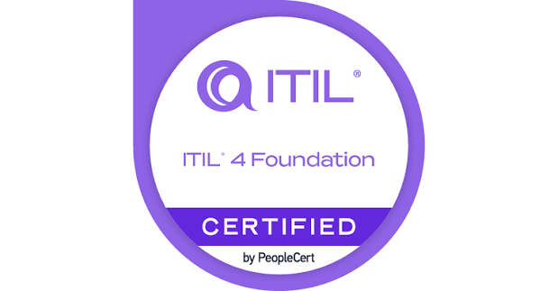
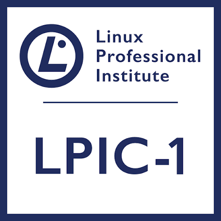
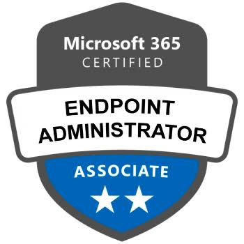

# Leonardo Azevedo

### Linux Specialist | Observability com Zabbix & Grafana | Incident Management N3 | IAM com Azure AD / Active Directory

**Infraestrutura crítica, alta disponibilidade, segurança e melhoria contínua para ambientes on-premises e cloud.**

[](https://www.linkedin.com/in/azevedo-leonardo/)


---

## 👨‍💻 Sobre mim

Sou **Analista de Infraestrutura e Segurança da Informação**, com atuação em **ambientes críticos, corporativos e governamentais**, focado em **Linux, Observabilidade, IAM, resposta a incidentes N3 e continuidade operacional**.

Atuo com administração e troubleshooting de servidores **Rocky Linux** e **Ubuntu Server**, análise avançada de logs, diagnóstico de falhas complexas, performance, estabilidade e otimização de recursos em ambientes de missão crítica.

Tenho experiência com **Zabbix** e **Grafana** para monitoramento proativo, criação de dashboards, definição de triggers, análise de métricas e suporte à tomada de decisão operacional. Minha atuação também envolve **Incident Management N3**, aderência a **SLA**, apoio em **Root Cause Analysis (RCA)**, documentação técnica e melhoria contínua para aumento de confiabilidade, resiliência e padronização operacional.

Além do ecossistema Linux, possuo experiência em **IAM com Microsoft Azure AD / Microsoft Entra ID e Active Directory**, administração de endpoints com **SCCM / Intune**, ambientes **Windows Server**, virtualização, **Docker**, bancos de dados **Oracle** e **SQL Server**, conectando infraestrutura on-premises, cloud, segurança e automação.

---

## 🧭 Posicionamento técnico

- 🐧 **Linux Specialist** com foco em Rocky Linux, Ubuntu Server, serviços críticos e troubleshooting avançado
- 📊 **Observability & Monitoring** com Zabbix, Grafana, métricas, triggers, dashboards e análise operacional
- 🚨 **Incident Management N3** com foco em SLA, RCA, mitigação de impacto e continuidade dos serviços
- 🔐 **IAM & Segurança** com Azure AD / Microsoft Entra ID, Active Directory, grupos, usuários e políticas de acesso
- 🧱 **Infraestrutura crítica e alta disponibilidade** em ambientes corporativos, governamentais e de missão crítica
- 🐳 **Docker e automação** para modernização, padronização e eficiência operacional
- 🖥️ **Endpoint Management** com SCCM, Intune, Microsoft 365 e Windows Server
- 🗄️ **Bancos de dados e aplicações corporativas** com Oracle, SQL Server e suporte a ambientes produtivos

---

## 🛠️ Tecnologias e ferramentas

### Infraestrutura, Linux, Observabilidade e Cloud

[](https://skillicons.dev)


### Desenvolvimento, scripts e web

[](https://skillicons.dev)

---

## 🎓 Certificações e cursos

<p align="center">
  <a href="#"></a>
  <a href="#"></a>
  <a href="#"></a>
  <a href="#"></a>
</p>
  
---

## 🎓 Formação acadêmica

- 🎓 **Bacharelado em Sistemas de Informação** — Centro Universitário UniFatecie
- 🛡️ **Pós-graduação em Segurança da Informação** — Faculdade Focus
- 💻 **Técnologo em Análise e Desenvolvimento de Sistemas** — Wyden
- 📡 **Técnico em Telecomunicações** — Instituto Federal Fluminense (IFF)

---

## ✍️ Artigos técnicos

Escrevo conteúdos técnicos com foco em infraestrutura, Linux, suporte avançado, troubleshooting e dados.

### Temas recorrentes

- Linux em ambientes corporativos
- SSH, hardening e boas práticas de acesso
- Logs, análise de eventos e troubleshooting
- Permissões de arquivos e diretórios no Linux
- Bash e automação de tarefas
- Arquitetura Linux e Filesystem Hierarchy Standard (FHS)
- Suporte técnico em Linux
- Observabilidade, métricas e estabilidade operacional
- Ciência de Dados, Python e análise aplicada

---

## 🚀 Projetos em destaque

> Estrutura preparada para destacar projetos relevantes de infraestrutura, automação, observabilidade, segurança e desenvolvimento.

<table>
  <tr>
    <td width="50%" valign="top">
      <h3>🐧 Linux Automation Toolkit</h3>
      <p>Scripts e automações para administração, diagnóstico e padronização de ambientes Linux.</p>
      <p><strong>Status:</strong> Em construção</p>
      <a href="https://github.com/Azevedo1996">Ver repositórios</a>
    </td>
    <td width="50%" valign="top">
      <h3>📊 Observability Lab</h3>
      <p>Laboratório com Zabbix, Grafana, métricas, dashboards e simulações de incidentes.</p>
      <p><strong>Status:</strong> Em construção</p>
      <a href="https://github.com/Azevedo1996">Ver repositórios</a>
    </td>
  </tr>
  <tr>
    <td width="50%" valign="top">
      <h3>🔐 IAM & Security Notes</h3>
      <p>Anotações, boas práticas e documentação técnica sobre IAM, AD, Entra ID e segurança operacional.</p>
      <p><strong>Status:</strong> Em construção</p>
      <a href="https://github.com/Azevedo1996">Ver repositórios</a>
    </td>
    <td width="50%" valign="top">
      <h3>🐳 Docker On-Prem Lab</h3>
      <p>Ambientes containerizados para estudos, testes e padronização de serviços locais.</p>
      <p><strong>Status:</strong> Em construção</p>
      <a href="https://github.com/Azevedo1996">Ver repositórios</a>
    </td>
  </tr>
</table>

---

## 📊 Estatísticas do GitHub

<div align="center">


<br><br>


<br><br>


</div>

---

## 📌 Áreas de interesse

```text
Linux • Observability • Zabbix • Grafana • Incident Management • N3 • SLA • RCA
IAM • Microsoft Entra ID • Azure AD • Active Directory • Segurança da Informação
Docker • Windows Server • SCCM • Intune • Oracle • SQL Server • Automação • Cloud
```

---

### Vamos conectar infraestrutura, segurança e observabilidade para manter ambientes críticos mais resilientes.

[](https://www.linkedin.com/in/azevedo-leonardo/)
