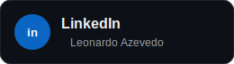
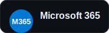
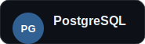
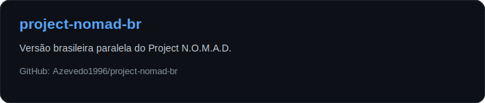
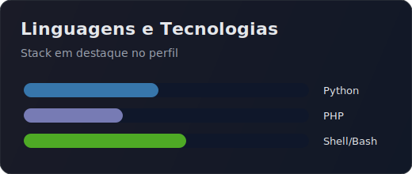

# Olá 👋, eu sou Leonardo Azevedo

### Analista de Infraestrutura • Linux • Observabilidade

**Linux Administration | Docker | Zabbix | Grafana | Segurança da Informação | Automação**

---

## 🚀 Sobre mim

- 🔭 Atualmente atuando na **Minsait Brasil**
- 🎓 Graduado em **Análise e Desenvolvimento de Sistemas**
- 🔐 Pós-graduado em **Segurança da Informação**
- 🐧 Especialista em **Linux**
- ☁️ Experiência com **Microsoft 365, Docker, Monitoramento e Automação**
- 📊 Atuação com **Zabbix, Grafana e Observabilidade**
- ⚙️ Entusiasta de automação, DevOps e infraestrutura como código

---

## 🏆 Certificações

  
  
  
  

---

## 📫 Entre em contato

  

---

## 💻 Tecnologias

### Linguagens

### Infraestrutura e Observabilidade

### Banco de Dados e Ferramentas

---

## 🎯 Áreas de Especialização

| Área | Foco |
|---|---|
| 🐧 **Linux Administration** | Administração, troubleshooting, serviços e hardening |
| ☁️ **Microsoft 365 Administration** | Administração de ambientes Microsoft 365 |
| 📊 **Monitoring & Observability** | Monitoramento com Zabbix e Grafana |
| 🐳 **Containers e Docker** | Ambientes conteinerizados e automação |
| 🔒 **Segurança da Informação** | Boas práticas, controle e proteção de ambientes |
| ⚙️ **Automação** | Scripts com Bash e Python |
| 🗄️ **Banco de Dados** | MySQL e PostgreSQL |

---

## 📌 Projetos em Destaque

  

---

## 📊 GitHub Stats

  
    
  

---

> “Automatizar o repetitivo, monitorar o crítico e simplificar o complexo.”

